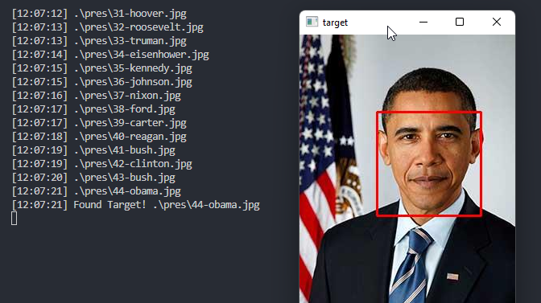

# FaceScrape
FaceScrape tries to find a target's face on a website by first scraping every available image and then checking for matches.  
For a higher chance of matching make sure to use a high res picture where all facial features are visible.
### Notes:
- This is only for testing, the process of matching is very slow.  ⚠️
- Masks or other things obstructing the face may lead to false positives, wrong detections, etc...
- I just wanted to play around with the face recognition library.

# Usage: 
#### Scrape.py 🪛:
Scrapes target site for images and downloads them to specified folder, where:

* `-u/--url` is the target's site
* `-p/--path` is the folder where the pictures will be saved

*Example:*  
`python3 Scrape.py -u "https://www.loc.gov/free-to-use/presidential-portraits/" -p "presidents/" `

#### Find.py 🔍:
Loops trough specified images and tries to find a face match, where:

* `-t/--target` is the targets face
* `-p/--path` is the path to the scraped images folder
* `-v/--verbose` is a logging option

*Example:*  
`python3 Find.py -t "obama.jpg" -p "presidents/*" -v true`

#### Clean.py 🧹:
Removes unwanted images from image folder

* `edit file directly`

# Example:  
Image used for encoding: [Obama](https://upload.wikimedia.org/wikipedia/commons/8/8d/President_Barack_Obama.jpg)  
President images scraped from: [Portraits](https://www.loc.gov/free-to-use/presidential-portraits/)

